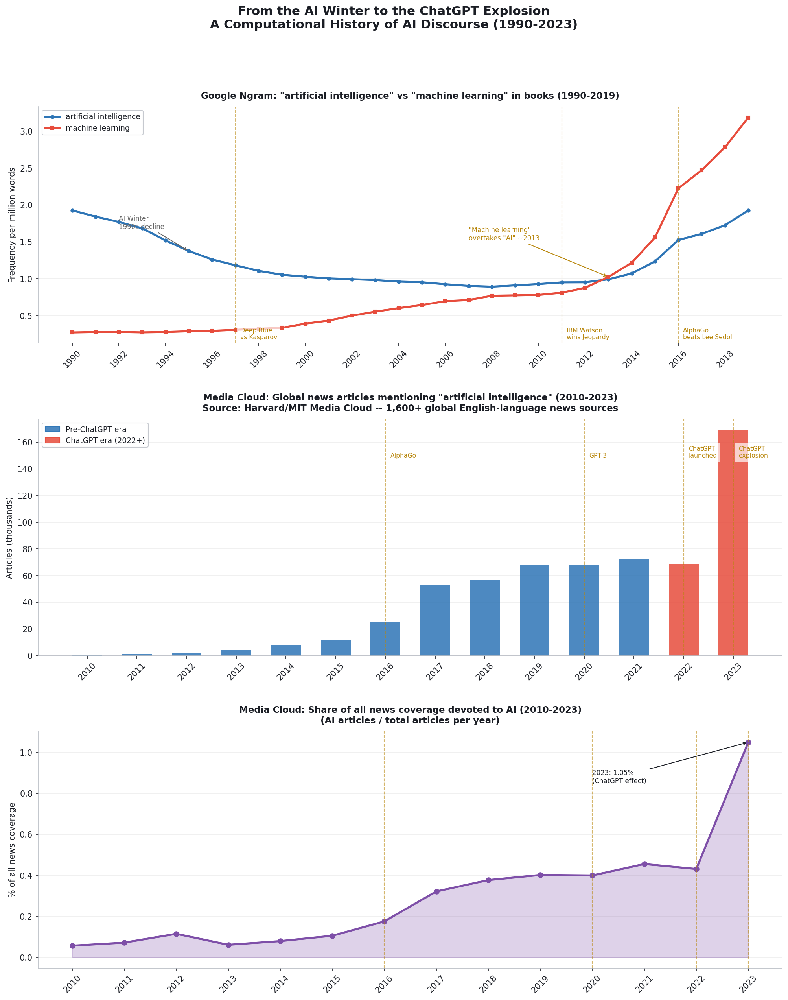

# From Scientific Optimism to Geopolitical Anxiety

A computational history of AI discourse, 1990–2023 — treating media coverage of
artificial intelligence as a **primary source** for how societies negotiate power,
fear, and technological change.

**🔗 Live exhibit: https://potchara1411.github.io/Digital-history-project/**



## Framing

**Primary frame — filling a scholarly gap.** Kate Crawford's *Atlas of AI* (Yale
University Press, 2021) argues powerfully that AI is a system of power and
extraction — but it never proves *computationally* when public discourse actually
shifted, or how fast. This project supplies that missing evidence: thirty years of
book data and thirteen years of global news data, locating the turning points and
measuring their speed. It also flips the usual question — instead of *what AI can do
for historians*, it asks **what historians can do with AI discourse as a primary
source.**

**Secondary frame — a historical parallel.** The rhetoric around AI in the
2010s–20s (fear, national competition, existential threat, demands for state
control) mirrors **nuclear anxiety of the 1950s–60s**. Societies reuse established
templates for technological fear, making AI anxiety historically legible rather than
unprecedented.

## The core argument

AI discourse was **not** a gradual shift from optimism to fear. The tone of coverage
was **negative in every year measured, even in 2010** — there was no golden age of
optimism to fall from. What actually changed was **scale** (attention exploded after
AlphaGo in 2016 and ChatGPT in 2022–23) and **political salience** (AI moved from a
*scientific* keyword to a *geopolitical* one). This is the historical claim the
project defends.

## The exhibit

A single-page web exhibit ([`index.html`](index.html), published via GitHub Pages):

1. **The Winter and the Rebranding (1990–2013)** — Ngram. "Artificial intelligence"
   *declines* through the AI Winter while "machine learning" rises and overtakes it
   around 2013.
2. **Back into the Light (2012–2021)** — Media Cloud. News coverage climbs as deep
   learning and AlphaGo bring AI back to the front page.
3. **The ChatGPT Explosion (2022–2023)** — Media Cloud. AI's *share* of all news
   more than doubles in a year, to ~1% of everything in the press.
4. **It was never optimism** — GDELT tone. Coverage is negative every year (~−5):
   the "optimism → fear" story is wrong.
5. **Robustness check** — GDELT's *normalized* coverage and Media Cloud's share
   track closely over 2017–2023 and land at nearly the same 2023 value (~1.04% vs
   ~1.05%), confirming the surge is real.

## Sources

### Conventional sources (framing)
- **Kate Crawford, *Atlas of AI*** (Yale University Press, 2021) — theoretical frame.
- **Print archives** — *Wired*, *TIME*, *The Economist* (1990–), consulted for how
  mainstream media framed AI for general audiences.
- **Policy documents** — White House AI strategy reports, Congressional records.

These inform the framing; they are not part of the quantitative analysis.

### Digital sources (evidence)

| Source | File | Coverage | Notes |
|--------|------|----------|-------|
| Google Books Ngram | `data/ngram_ai_ml_1990_2019.csv` | 1990–2019 | Phrase frequency as a fraction of all text; ×1e6 in the chart. |
| Media Cloud | `data/mediacloud_ai_2010_2023.csv` | 2010–2023 | Yearly totals aggregated from `data/mediacloud_ai_daily_2010_2023.csv`. `count` = AI articles; `ratio` = count ÷ total articles. |
| GDELT — raw counts | `data/gdelt_results.csv` | 2010–2023 | **Rejected as a trend** (see source criticism). Also supplies the `avg_tone` series. |
| GDELT — normalized | `data/gdelt_ai_volume_daily_2017_2023.csv` | 2017–2023 | "Volume Intensity" = AI's % of all coverage GDELT monitors. Used for the robustness check. |

**Method.** Quantitative pattern detection paired with qualitative historical
interpretation — adapting the semantic-shift approach Dr. Woo applied to Cold War
newspapers, here turned on AI discourse across three decades.

### Provenance

**Google Books Ngram** — [Ngram Viewer](https://books.google.com/ngrams): terms
`artificial intelligence` / `machine learning`, corpus **English 2019** (`en-2019`),
smoothing **3**, **1990–2019**, case-sensitive.

**Media Cloud** — [search.mediacloud.org](https://search.mediacloud.org): query
`artificial intelligence`, **Online News Archive** collection, **2010-01-01 –
2023-12-31** (daily, summed by year), exported **2026-06-01**.

**GDELT** — [DOC 2.0 API](https://api.gdeltproject.org/api/v2/doc/doc) `timelinevol`
mode for normalized volume (`"artificial intelligence"`, **2017–2023**); the
`avg_tone` series is the earlier events export.

### Source criticism
- **Google Ngram** ends in 2019 and covers *books*, not journalism — it misses the
  ChatGPT moment in print entirely.
- **Media Cloud** skews toward English-language sources, underrepresenting
  non-Western perspectives.
- **GDELT raw counts** jump ~10,000× between 2013 and 2015 when GDELT 2.0 expanded
  its sources — the instrument changed, not the world. So only GDELT's *normalized*
  share and its *tone* (an average, far less distorted) are used, and the small
  2010–2013 samples are flagged in the chart.

These limits are treated as **part of the historical argument**, not hidden as
flaws.

## Reproducing the analysis

```bash
python3 -m venv venv
source venv/bin/activate          # Windows: venv\Scripts\activate
pip install -r requirements.txt
python ai_final.py        # regenerates all charts in figures/
python build_slides.py    # rebuilds the presentation deck (optional)
```

The script resolves paths relative to its own location, so it runs from any working
directory. It writes the combined narrative figure (`ai_discourse_final.png`) plus
standalone panels for the exhibit: `panel1_ngram.png`, `panel2_volume.png`,
`panel3_share.png`, `panel4_robustness.png`, and `panel5_tone.png`.

## Project structure

```
.
├── index.html              # the web exhibit (published via GitHub Pages)
├── style.css               # shared light theme
├── ai_final.py             # analysis + figure generation (single source of truth)
├── build_slides.py         # builds the PowerPoint deck
├── ai_discourse_slides.pptx# presentation (with speaker notes)
├── PRESENTATION_SCRIPT.md  # the speaker script + Q&A prep
├── data/                   # source datasets (CSV)
├── figures/                # generated charts (regenerable)
├── requirements.txt
└── README.md
```

## Publishing updates

The site is served from `main` by GitHub Pages. After changing data, charts, or
`index.html`, regenerate and push:

```bash
python ai_final.py
git add -A && git commit -m "Update exhibit" && git push
```

GitHub Pages rebuilds automatically within about a minute.
